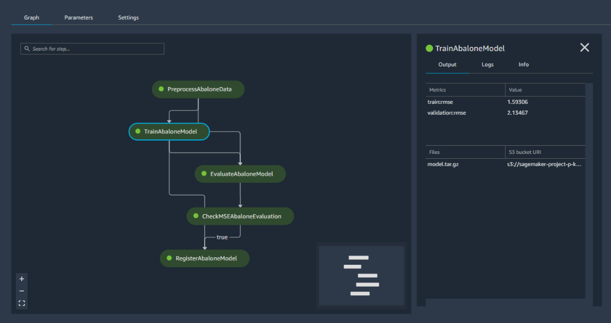

## MLOps workshop with Amazon SageMaker
Machine Learning Ops Workshop with Amazon SageMaker Pipelines: lab guides and materials.

## Introduction

In machine learning, you "teach" a computer to make predictions, or inferences. First, you use an algorithm and example data to train a model. Then you integrate your model into your application to generate inferences in real time and at scale. In a production environment, a model typically learns from millions of example data items and produces inferences in hundreds to less than 20 milliseconds.

The following diagram illustrates the typical workflow for creating a machine learning model:

As the diagram illustrates, you typically perform the following activities:

- Identifying a business problem and the related Machine Learning problem.
- Data ingestion, integration and preparation.
- Data visualization and analysis, feature engineering, model training and model evaluation.
- Model deployment, model monitoring and debugging.

These steps are regularly repeated during the lifetime of the machine learning application for multiple reasons: to include new features to adjust to changing business goals, to  retrain the models on new available data to keep high performnce of the model, to iteratively update the model architecture, and other. This workshop will demonstrate how to implement MLOps practice in your organisation and increase automation and improve quality and time-to-production.

## Amazon SageMaker Pipelines - Managed machine learning CI/CD service 
Amazon SageMaker Pipelines is the first purpose-built, easy-to-use continuous integration and continuous delivery (CI/CD) service for machine learning (ML). With SageMaker Pipelines, you can create, automate, and manage end-to-end ML workflows at scale.

Orchestrating workflows across each step of the machine learning process (e.g. exploring and preparing data, experimenting with different algorithms and parameters, training and tuning models, and deploying models to production) can take months of coding.

Since it is purpose-built for machine learning, SageMaker Pipelines helps you automate different steps of the ML workflow, including data loading, data transformation, training and tuning, and deployment. With SageMaker Pipelines, you can build dozens of ML models a week, manage massive volumes of data, thousands of training experiments, and hundreds of different model versions. You can share and re-use workflows to recreate or optimize models, helping you scale ML throughout your organization.

Key Features:
- Compose, manage, and reuse ML workflows.
- Choose the best models for deploying into production.
- Automatic tracking of models.
- Bring CI/CD to machine learning.

## Modules

This workshops consists of four modules:

- [**Module 01**](labs/01_configure_sagemaker_studio/): Configure Amazon SageMaker Studio and Jupyter notebooks kernel.
- [**Module 02**](labs/02_initial_notebook/): Transform the data and train a model inside a Jupyter nootebook.
- [**Module 03**](labs/03_manual_sagemaker_process_train/): Transform the data and train a model using SageMaker managed training job.
- [**Module 04**](labs/04_workflow_sm_pipelines/): Automate the whole dataset preparation and model training pipeline with SageMaker Pipelines.
- [**Module 05**](labs/05_model_monitor/): Analyze a training dataset to generate baseline constraints and monitor a live endpoint for violations against constraints with SageMaker Model Monitor.

You must comply with the order of modules, since the outputs of a module are inputs of the following one.

## Prerequisites

### AWS Account

This workshop has been designed assuming that each participant is using an AWS account that has been provided and pre-configured by the workshop instructor(s). However, you can also choose to use your own AWS account, but you'll have to execute some preliminary configuration steps as described below.

**Permissions**: In order to complete this workshop you'll need an AWS Account, and an AWS IAM user in that account with at least full permissions to the following AWS services: 

- AWS IAM
- Amazon S3
- Amazon SageMaker
- AWS CloudShell or AWS Cloud9
- Amazon EC2:  including P3, C5, and M5 instance types; to check your limits, see [Viewing Your Current Limits](https://docs.aws.amazon.com/AWSEC2/latest/UserGuide/ec2-resource-limits.html).  If you do not have at least the default limits specified in [the Amazon SageMaker Limits table](https://docs.aws.amazon.com/general/latest/gr/sagemaker.html), please file a limit increase request via the AWS console.

**Use Your Own Account**: The code and instructions in this workshop assume only one student is using a given AWS account at a time. If you try sharing an account with another student, you'll run into naming conflicts for certain resources. You can work around these by appending a unique suffix to the resources that fail to create due to conflicts, but the instructions do not provide details on the changes required to make this work. Use a personal account or create a new AWS account for this workshop rather than using an organization’s account to ensure you have full access to the necessary services and to ensure you do not leave behind any resources from the workshop.

**Costs**: Some, but NOT all, of the resources you will launch as part of this workshop are eligible for the AWS free tier if your account is less than 12 months old. See the [AWS Free Tier page](https://aws.amazon.com/free/) for more details. An example of a resource that is **not** covered by the free tier is the Amazon SageMaker instance types used in some workshops. To avoid charges for endpoints and other resources you might not need after you've finished a workshop, do not forget to terminate the resources. 

### AWS Region

Amazon SageMaker is not available in all AWS Regions at this time.  Accordingly, we recommend running this workshop in one of the following supported AWS Regions:  N. Virginia, Oregon, Ohio, Ireland or Sydney.

Once you've chosen a region, you should create all of the resources for this workshop there, including a new Amazon S3 bucket and a new SageMaker notebook instance. Make sure you select your region from the dropdown in the upper right corner of the AWS Console before getting started.

## Getting started

Once you are ready to go, please start with [**Module 01**](labs/01_configure_sagemaker_studio/).

## Security

See [CONTRIBUTING](CONTRIBUTING.md#security-issue-notifications) for more information.

## License

This library is licensed under the MIT-0 License. See the LICENSE file.

