# MLOps workshop with Amazon SageMaker

# Workshop Instructions
_Note: This workshop will create an ephemeral AWS acccount for each attendee.  This ephemeral account is not accessible after the workshop.  You can, of course, clone this GitHub repo and reproduce the entire workshop in your own AWS Account._

## 0. Logout of All AWS Consoles Across All Browser Tabs
If you do not logout of existing AWS Consoles, things will not work properly.

_Please logout of all AWS Console sessions in all browser tabs._

## 1. Login to the Workshop Portal (aka Event Engine). 
Open https://dashboard.eventengine.run/

Using the hash code you got from workshop admins, paste the event-hash-login that will be shared with you in the browser window. 

Choose the Accept Terms & Login. 

Choose OTP.

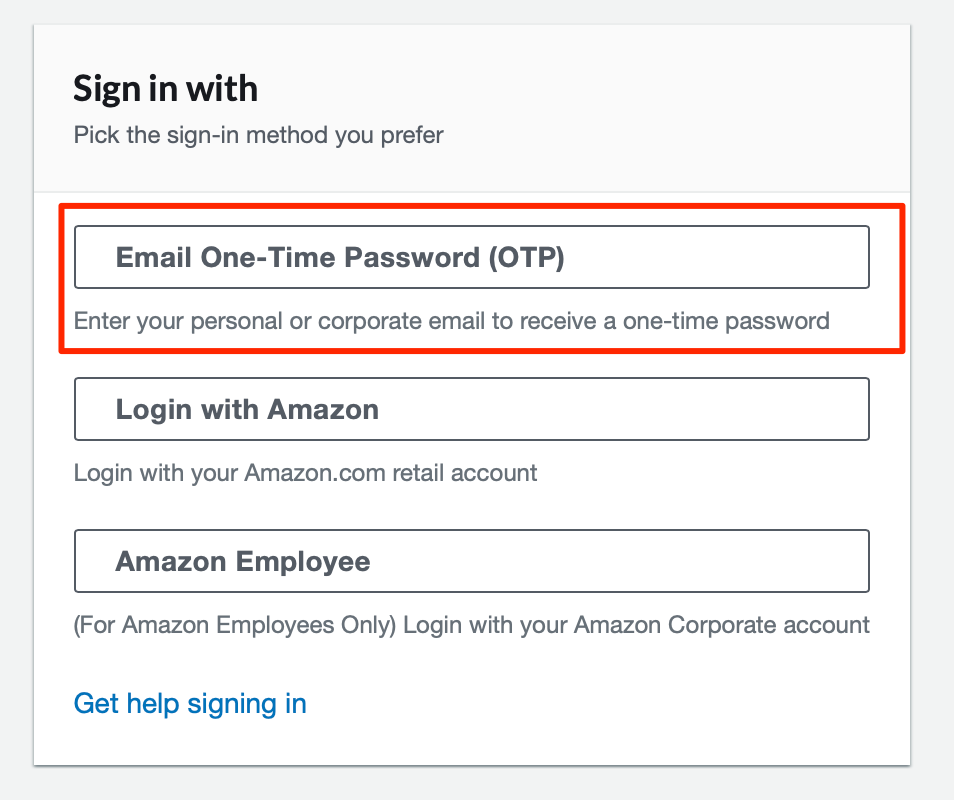

Write the Email that the passcode will be sent to, and choose Send passcode.

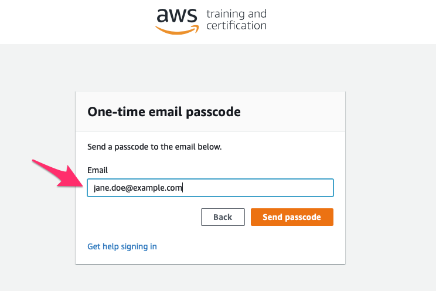

Copy the One-time email passcode from your inbox and paste it here.

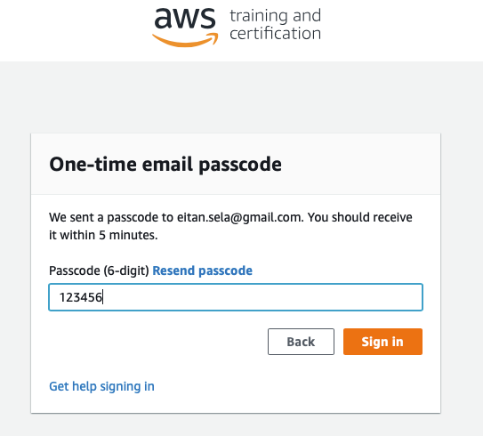

Choose AWS Console.

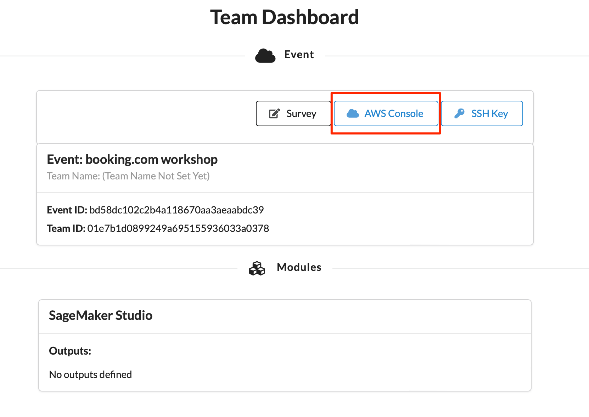

## 2. Login to the **AWS Console**

Take the defaults and click on **Open AWS Console**. This will open AWS Console in a new browser tab.

If you see this message, you need to logout from any previously used AWS accounts.

_Please logout of all AWS Console sessions in all browser tabs._

Double-check that your account name is similar to `TeamRole/MasterKey` as follows:

If not, please logout of your AWS Console in all browser tabs and re-run the steps above!

## 3. Launch SageMaker Studio

Open the [AWS Management Console](https://console.aws.amazon.com/console/home)

**Note:** This workshop has been tested on the US East (N. Virginia) (us-east-1) region. Make sure that you see **N.Virginia** on the top right hand corner of your AWS Management Console. If you see a different region, click the dropdown menu and select US East (N. Virginia).

In the AWS Console search bar, type `SageMaker` and select `Amazon SageMaker` to open the service console.

. 

Now, click on `Domains`:

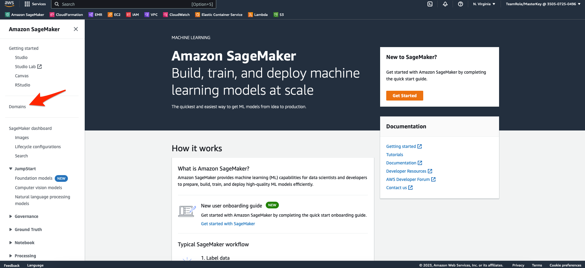

Now, click on `StudioDomain`:

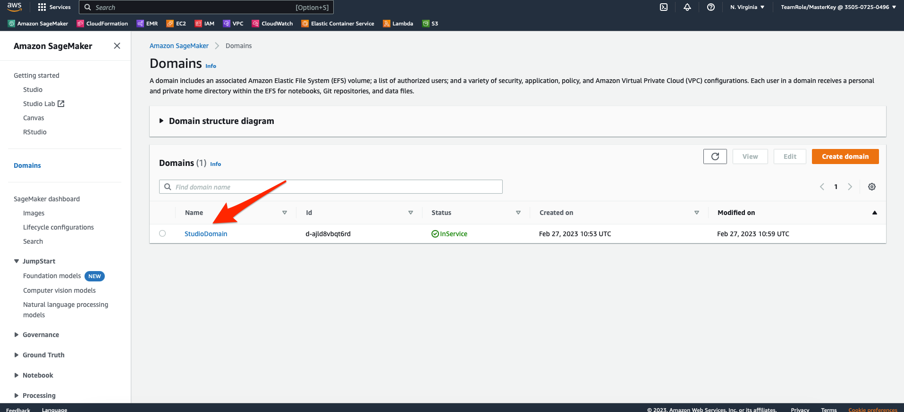

Now, click the `Launch` button and click `Studio` (the first time you open SageMaker Studio this step might take few minutes to launch).

## 4. Clone the GitHub Repo
Click the Git icon (1 in the picture) and then select `Clone a repository` (step 2).

Type in the URL of this repository (https://github.com/aws-samples/amazon-sagemaker-mlops-workshop.git) and click `Clone`.

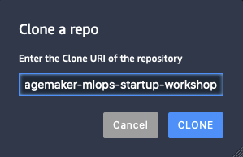

## 5. Start the Workshop!

In the File Browser, double click `amazon-sagemaker-mlops-startup-workshop`, then `labs`, and then `02_initial_notebook` and open the `02_initial_notebook.ipynb` Jupyter notebook.

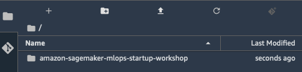

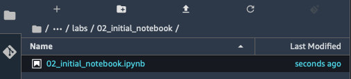

Select the "Python 3 (TensorFlow 2.3 Python 3.7 CPU Optimized)" Kernel by clicking "No Kernel" at the bottom. 

Then wait until the kernel has started. This step might take few minutes to launch.

Start the workshop!

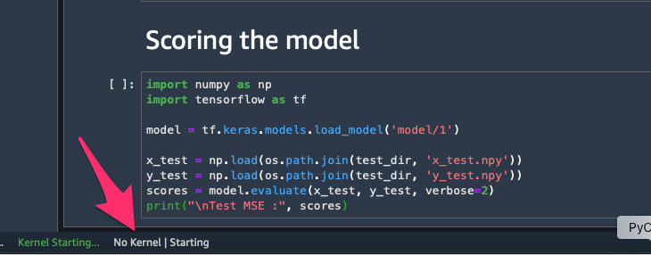

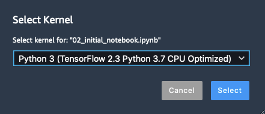

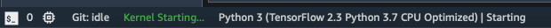

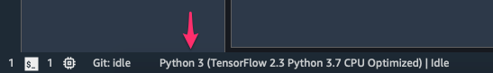

